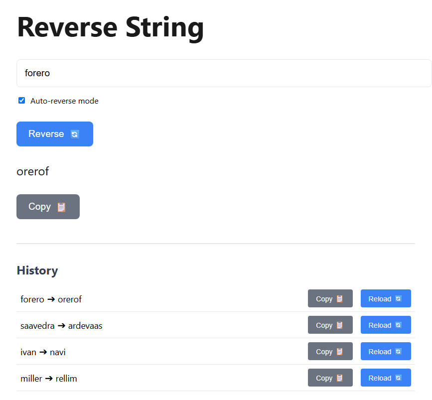

# String Reversal App Documentation

## Table of Contents
1. [Successful Prompts](#successful-prompts)
   - [Initial Request](#initial-request)
   - [HTML Structure Request](#html-structure-request)
   - [JavaScript Functionality Request](#javascript-functionality-request)
   - [History Feature Request](#history-feature-request)
   - [Documentation Request](#documentation-request)
   - [Key Learnings](#key-learnings)

2. [Failed Prompts](#failed-prompts)
   - [Initial Attempts](#initial-attempts)
     - [Single File Generation](#attempt-1-single-file-generation)
     - [Next.js Implementation](#attempt-2-nextjs-implementation)
     - [Incomplete Styling](#attempt-3-incomplete-styling)
   - [Feature Implementation Attempts](#feature-implementation-attempts)
     - [History Feature](#attempt-4-history-feature)
     - [Auto-Reverse Mode](#attempt-5-auto-reverse-mode)

3. [Chatbot Used](#chatbot-used)

4. [Corrections and Learnings](#corrections-and-learnings)
    - [Common Patterns in Failed Prompts](#common-patterns-in-failed-prompts)
    - [How to Write Better Prompts](#how-to-write-better-prompts)
    
## Successful Prompts

### Initial Request
**Prompt:** "Crea una página web con lógica en javascript que invierta el orden de una cadena de texto. Ejemplo: si introduzco AI4Devs devuelve sveD4IA."
- **Purpose:** Initial project setup request
- **Expected Outcome:** Basic understanding of the project requirements - a web page that reverses text strings
- **Key Points:** Two files needed (HTML and JavaScript), basic string reversal functionality

### HTML Structure Request
**Prompt:** "First create the HTML file that looks like the attached image."
- **Purpose:** Create the visual structure and styling of the application
- **Expected Outcome:** Complete HTML file with CSS styling matching the provided design
- **Key Points:** Modern design, input field, buttons with icons, result display

### JavaScript Functionality Request
**Prompt:** "now create the script.js file will handle the string reversal and copy functionality"
- **Purpose:** Implement the core functionality of the application
- **Expected Outcome:** JavaScript file with string reversal and clipboard functionality
- **Key Points:** Event listeners, DOM manipulation, string operations

### History Feature Request
**Prompt:** "Below the text input field, display a list of the history of reversed strings in the session. Each entry must have: A button to copy the string to the clipboard. A button to reload that string into the input. An automatic mode checkbox enabled."
- **Purpose:** Add history tracking and additional features
- **Expected Outcome:** Enhanced functionality with history management and auto-reverse mode
- **Key Points:** 
  - History tracking in memory
  - Copy and reload functionality for history items
  - Auto-reverse checkbox implementation

### Documentation Request
**Prompt:** "Create a .md file with all the prompts you use and write a short description of each one."
- **Purpose:** Document the development process and prompts used
- **Expected Outcome:** Markdown file with organized documentation
- **Key Points:** Clear descriptions of each prompt's purpose and outcomes

### Key Learnings
- Each prompt builds upon the previous ones in a logical sequence
- Clear and specific requirements help generate more accurate responses
- Visual references (attached images) improve accuracy of implementation
- Breaking down complex features into smaller requests yields better results

## Failed Prompts

### Initial Attempts

#### Attempt 1: Single File Generation
**Failed Prompt:** "Create a web page that reverses text strings"
- **Why it Failed:** Too vague and didn't specify the need for separate HTML and JS files
- **Lesson Learned:** Be specific about file structure requirements
- **Better Approach:** "Create two separate files (index.html and script.js) for a web page that reverses text strings"

#### Attempt 2: Next.js Implementation
**Failed Prompt:** "Create a Next.js app that reverses strings"
- **Why it Failed:** Overcomplicated the solution by using a framework when vanilla HTML/JS was required
- **Lesson Learned:** Don't assume modern frameworks are needed
- **Better Approach:** Stick to the basic requirements unless specifically asked for a framework

#### Attempt 3: Incomplete Styling
**Failed Prompt:** "Create the HTML with styling"
- **Why it Failed:** Didn't reference the provided image, resulting in incorrect styling
- **Lesson Learned:** Always reference provided visual materials
- **Better Approach:** "Create the HTML file that matches the styling shown in the attached image"

### Feature Implementation Attempts

#### Attempt 4: History Feature
**Failed Prompt:** "Add history functionality"
- **Why it Failed:** Too vague, didn't specify the requirements for copy and reload buttons
- **Lesson Learned:** Detail all required features in the prompt
- **Better Approach:** "Add a history section that displays previous reversals with copy and reload functionality for each entry"

#### Attempt 5: Auto-Reverse Mode
**Failed Prompt:** "Add automatic reversal"
- **Why it Failed:** Didn't specify when auto-reverse should trigger and how it interacts with history
- **Lesson Learned:** Be explicit about feature behavior and interactions
- **Better Approach:** "Add an auto-reverse checkbox that, when enabled, automatically reverses text as it's typed, but only saves to history on copy"

## Chatbot Used
Claude Sonnet 3.5

## Corrections and Learnings
1. At the beginning, I made the entire request without specifying that I should separate the HTML from the JS.
2. I fixed it once I realized the response only gave me the HTML code and mixed the JS, so I specified that each file should be created separately.
3. I learned that it's not about creating the prompt the first time and that it should be refined, being as specific as possible and also verifying that the code and functionality go hand in hand as expected.

### Common Patterns in Failed Prompts
1. Vague or incomplete requirements
2. Lack of reference to provided materials
3. Overcomplicating solutions
4. Missing specific feature behaviors
5. Unclear interaction between components

### How to Write Better Prompts
1. Be specific about file structure
2. Reference visual materials when available
3. Detail all required features
4. Explain component interactions
5. Specify exact behaviors
6. Keep technology requirements clear