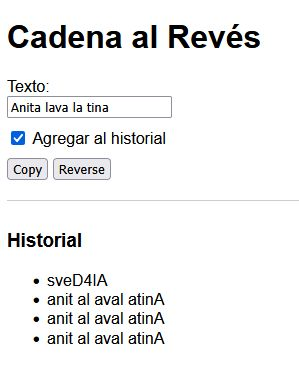
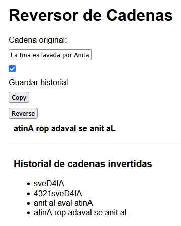

# Reverse String

## Prompts Utilizados

### Prompt Inicial

```
Eres un experto desarrollador web full-stack.
Escribe el código de una aplicación web HTML("index.html") / JS ("script.js") que:

* Tenga un formulario con un cuadro de texto ("txtOriginalString"), un checkbox ("chkMode"), dos botones ("btnCopy", "btnReverse").
* Solicite en el cuadro de texto ("txtOriginalString") una cadena de caracteres.
* Al presionar el primer botón con la etiqueta "Copy" ("btnCopy"), copie la cadena del cuadro de texto al portapapeles.
* Al presionar el segundo botón con la etiqueta"Reverse" ("btnReverse"), recupere la cadena del portapapeles y invierta.
* El checkbox ("chkMode") deberá estar inicialmente marcado
* Si "chkMode" está marcado, al presionar "btnReverse" se debe agregar la cadena del cuadro de texto invertida, en la parte inferior del formulario, a manera de historial.
  Ejemplo de cadenas invertidas:
* AI4Devs, devuolvería sveD4IA.
```


#### Resultado




#### Comentario y resultados iniciales

La aplicación parecía funcionar bien, sin embargo al realizar algunas pruebas, se nota cierta comportamiento raro al presionar el botón "Reverse".
Luego noté que fue un error mío en la solicitud inicial pues le indiqué "recupere la cadena del portapapeles ...", con lo que si no se copiaba antes la cadena, no invertía o invertía la última copiada al portapapeles


### Segundo Prompt (final)

```
Eres un experto desarrollador web full-stack.
Escribe el código de una aplicación web HTML("index.html") / JS ("script.js") que:

* Tenga un formulario con un cuadro de texto ("txtOriginalString"), un checkbox ("chkMode"), dos botones ("btnCopy", "btnReverse").
* Solicite en el cuadro de texto ("txtOriginalString") una cadena de caracteres.
* Al presionar el primer botón con la etiqueta "Copy" ("btnCopy"), copie la cadena del cuadro de texto al portapapeles.
* Al presionar el segundo botón con la etiqueta"Reverse" ("btnReverse"), invierta la cadena del cuadro te texto y la muestre invertida al lado del cuadro de texto.
* El checkbox ("chkMode") deberá estar inicialmente marcado
* Si "chkMode" está marcado, al presionar "btnReverse" se debe agregar la cadena del cuadro de texto invertida, en la parte inferior del formulario, a manera de historial.
  Ejemplo de cadenas invertidas:
* AI4Devs, devuolvería sveD4IA.
```


#### Resultado




#### Comentario y resultados finales

La aplicación funcionó justo como la pensé, no solo eso, sino que asignó los nombres a los archivos y elementos HTML que le indiqué.


## ChatBot Utilizado

ChatGPT, versión gratuita, web


## Conclusiones

* Realmente nunca había intentado algo así con una IA, me sorprendió gratamente!!
* Ingresó algunos estilos sin que se los pidiera, por lo que tuvo incluso más iniciativa que varios desarrolladores Jr


