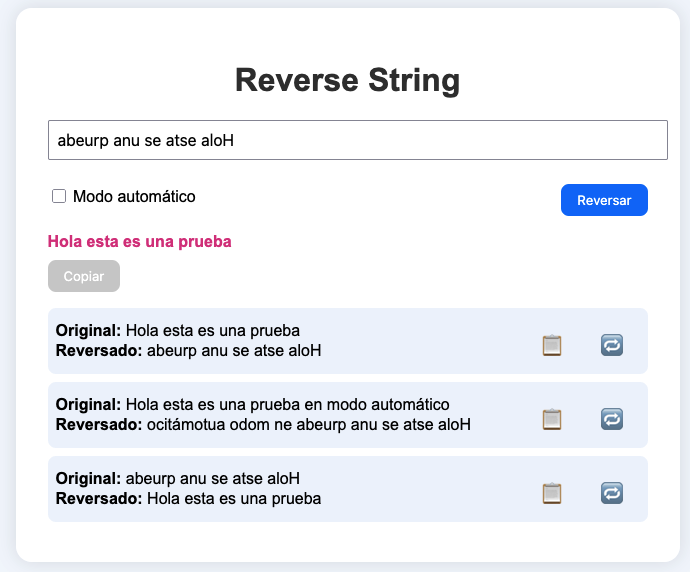

# 🌀 Reverse String Web App

Una aplicación interactiva para invertir cadenas de texto, desarrollada con HTML, CSS y JavaScript.

## 🚀 Características

- ✅ Campo de texto para ingresar cadenas.
- 🔄 Modo automático: invierte el texto a medida que escribes.
- 🔘 Botón “Reversar” para inversión manual.
- 🌈 Texto revertido resaltado con estilo llamativo.
- 📋 Botón “Copiar” (activo en modo automático).
- 📜 Historial enumerado que muestra:
  - Texto original
  - Texto invertido
  - Botón para copiar solo el texto invertido
  - Botón para cargar el texto invertido en el input

## 🧠 Reglas funcionales

- Si **Modo Automático** está activado:
  - El botón “Reversar” se deshabilita.
  - El texto se invierte en tiempo real.
  - El botón “Copiar” se activa y al hacer clic guarda el texto invertido en el historial.
- Si se da clic en el botón “Reversar”:
  - Se muestra un modal de éxito por 3 segundos.
  - Se muestra el texto revertido.
  - Se agrega al historial.
- Cambiar a modo automático con texto ya ingresado solo actualiza la salida, **sin añadir al historial**.

## 💻 Ejemplo de uso

### 1. Manual:

- Escribe: `Hola`
- Clic en “Reversar”
- Salida: `aloH`
- Aparece en historial

### 2. Automático:

- Activa “Modo Automático”
- Escribe: `Texto`
- Salida: `otxeT` (en vivo)
- Clic en “Copiar” ➜ agregado a historial

## 🧩 Buenas prácticas aplicadas

- Código modular y claro (funciones puras).
- Uso de `const` y `let` según contexto.
- Separación visual (CSS) y funcional (JS).
- Aplicación de principios SOLID en estructura JS.

---

💡 Puedes abrir `index.html` en tu navegador para ver el funcionamiento.
